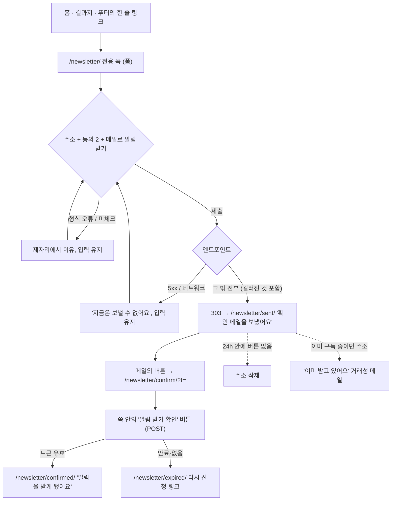
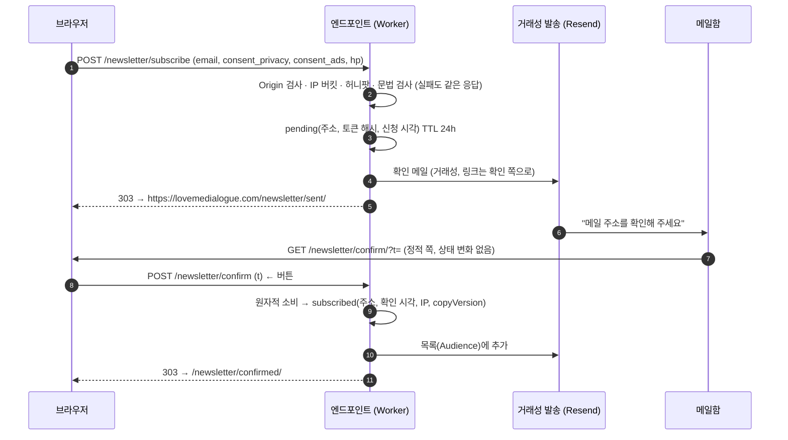

# 뉴스레터를 받을지 묻기 — UX 명세 (2판, 적대적 검토 반영)

> 질문: "뉴스레터를 받을 것인지 묻는 기능을 넣고 싶어. 다른 유사 서비스를 리서치하여 UX 명세서를 작성해줘."
> 이어서: "뉴스레터에 대한 적대적 검토 실행."
> 대상: `site/` (lovemedialogue.com). 상태: **제안 — 소유자 결정 D1~D5 대기.**
> 관련: `docs/WEB_SERVICE_STRATEGY.md`("The site earns attention and an email"; 안전 절), `docs/PRIVACY.md` 2.3·:115·:221,
> `docs/proposals/privacy-policy-ko.md:123-124`, `site/pages.js` privacyCopy(:131·:160·:190·:208·:237), `.ai/REVIEW.md`.
>
> 그림이 있는 판은 같은 내용의 아티팩트 페이지. 이 파일은 저장소에 남는 텍스트 판(mermaid 포함).
> **1판과 2판의 차이는 맨 끝 부록에 지적 항목별로 적었습니다.**

## 0. 2판에서 바뀐 것 (요약)

세 명의 독립 검토자(법·개인정보 / UX·안전 / 기술·보안)가 1판을 반증했고 셋 다 FAIL을 냈습니다. 지적은 대부분
타당했고, 한 가지 구조 변경이 그중 여럿을 한꺼번에 풉니다.

1. **폼은 전용 쪽 `/newsletter/` 하나에만.** 홈과 결과지에는 한 줄 링크만 둡니다. 결과지의 행동 유도 과밀, 기기에
   남는 구독 흔적, 상태·크기 불일치, 홈의 추가 스크립트가 함께 사라집니다(UX C2·M1·M2·M4, 기술 m4·m7).
2. **"(필수)" 표기 제거.** 두 체크박스 모두 기본 해제, 선택권을 전제한 문안(법 C1, UX M3).
3. **확인·해지는 POST 버튼으로.** 메일 스캐너가 GET을 대신 누르는 문제(기술 C3, 법 M5). RFC 8058 원클릭은 헤더 POST.
4. **JS 없는 경로 복구.** 클라이언트 시각 검사 삭제, 허니팟 이름·자동완성 차단, `/newsletter/sent/` 쪽 추가, 303은
   절대 URL(기술 C1·M1, UX C3).
5. **속도 제한과 Origin 검사**(기술 C2). 없으면 확인 메일 폭탄 장치.
6. **처리방침의 다섯 문장**을 조건부로 고치고, 개정 게시 → **30일** → 켜기의 2단계 배포(법 C2).
7. **수집 최소화**: UA 없음, IP는 확인 시에만, 해시 보관 없음, 동의 문안 버전 저장(법 M3·M4·M5, UX M7).
8. **발송 도구 결정을 다시 씀**: 스티비 경로에 확인 메일 발신 수단이 없었음(기술 C4·M8). D1을 세 구성으로.
9. 2년 재확인의 의미(무응답=유지), 국외이전 고지 항목, 수신거부 처리결과 통지, 14세 문안, 과태료 액수(법 M1·M2·M3·m1).
10. 「곧 열려요」→ 실제 라벨 「곧 만나요!」, 질문집 이름은 부르지 않음(UX C1, 기술 M5). 깔때기 수치 재계산(UX M6).

## 1. 목적

이 사이트는 지금까지 아무것도 받지 않았습니다. 뉴스레터는 독자가 자기 뜻으로 두고 가는 첫 번째 것이고, 그래서
묻는 방식이 곧 사이트의 신뢰입니다. 전략 문서는 웹의 역할을 "attention and an email"로 못 박습니다. 다만 "답을
서버로 보내지 않습니다"라는 약속이 목적의 절반을 정합니다. 뉴스레터는 **답과 분리된, 주소 하나만의 관계**입니다.

해야 하는 일 셋: (1) 새 질문집을 알린다 — 홈의 「곧 만나요!」 카드 다섯(연애·임신·출산·교육·노년, 이름은 화면에
없음)이 약속만 하고 지키는 방법이 없다. (2) 다시 오게 한다. (3) 앱으로 가는 길을 연다.

하지 않을 일: 질문 쪽에서 묻지 않는다. 모달·전면·이탈 감지 팝업을 쓰지 않는다. 답과 주소를 묶지 않는다(결과 전송은
X6). 점수·판정·"당신의 관계"를 말하는 제목을 보내지 않는다. **기기에 구독 흔적을 남기지 않는다**(2판).

**묻는 자리(2판):** 폼은 `/newsletter/` 한 쪽. 그리로 가는 링크 세 줄 — ① 홈의 「곧 만나요!」 묶음 바로 아래
"열리면 알려 드릴게요 →", ② 결과지의 「둘이 함께 해보기」 아래 같은 한 줄, ③ 푸터 「새 질문집 알림」. 링크는
묻는 것이 아니라 가리키는 것이라 닫기도, 기억도, 스크립트도 필요 없습니다. R-3의 Gottman·Perel이 이 형태이고,
R-4에서 가장 높은 수치("사용자가 눌러서 연 폼" 54%)가 이 형태의 것입니다.

## R. 유사 서비스 조사

(1판과 같음. 프록시가 원본 대부분을 막아 검색 발췌문으로 확인했고, 미확인 항목은 표시.)

### R-1. 플랫폼

| 서비스 | 묻는 형태 | 필드 | 더블 옵트인 | JS 없는 폼 | 데이터 | 동의 UI |
|---|---|---|---|---|---|---|
| Substack | 자기 사이트에서 도착 즉시 모달; "No thanks"(confirm-shaming). 임베드는 480px iframe | 이메일 | Substack 관리 | iframe만 | 미국(미확인) | 없음 |
| Buttondown | 순수 HTML 폼. **fetch로 보내지 말라**고 명시. "정적 사이트용" | 이메일 | 기본·강제 | 예 | 미국(AWS) | 없음 |
| Kit | JS 권장, HTML 폼 제공 | 이메일 | 기본 켜짐 | 예 | 미국 외 | EU에만 미체크 박스 |
| Mailchimp | `list-manage.com/subscribe/post`; JS 끄면 Mailchimp 감사 페이지 | 이메일(+이름) | **기본 꺼짐** | 예 | 미국 | GDPR 채널별 박스 |
| beehiiv | iframe+script | 이메일·이름·생일 | 폼별 | 아니오 | 미국(AWS) | — |

### R-2. 국내

- **스티비** — 호스팅 페이지 + HTML 내보내기. 필수는 이메일뿐. 개인정보 수집·이용 동의 + 광고성 정보 수신 동의
  체크박스, 2년 재확인 자동화. HTML 내보내기가 순수 폼인지·서버 위치·**자체 더블 옵트인 유무·API** 미확인.
- **메일리** — iframe. 광고 수신 동의 박스. 처리방침에 국외이전 명시.
- **뉴닉** — 이름·이메일·직업, "월/수/금 7시" 약속. 초기에 수신동의 없이 광고 → (광고) 표기로 대응.
- **캐릿** — 이메일 필수·거부 시 제공 불가·(광고) 포함·해지 시 자동 삭제를 한 문단에.
- **롱블랙** — 회원가입 뒤에만.

법 요건(확인됨): 사전 동의·(광고) 표기·수신거부 방법(망법 §50); 수신동의는 개인정보 동의와 **별개 항목**이며
**동의를 거부해도 서비스 제공을 거부할 수 없음**(개보법 §22⑤); 2년마다 재확인, 재확인 안내는 (광고) 메일과 따로
(시행령 §62의3 + KISA 안내서); KISA 7차(2026-03): 모호한 명칭 불가, 입증 책임은 발신자; 필수 약관에 묶은 마케팅
동의는 무효 — 위반 시 **망법 §76① 과태료 3천만 원 이하**(1판의 "1,000만 원"은 개보법 §75④ 동의방법 위반 액수로
노출을 과소평가); 국외 수탁자는 처리위탁(§26)**과** 국외이전(§28의8) 둘 다 적용.

### R-3. 관계·커플

Gottman「Marriage Minute」(전용 페이지, 이메일 하나, "every Tuesday and Thursday morning")과 Esther Perel(전용
`/newsletter`, "monthly")은 **전용 페이지 + 빈도 약속**으로 받고 활동을 끊지 않는다. 2판의 구조가 이것입니다.

### R-4. UX 연구와 수치

NN/g: 도착 즉시 모달은 가장 미움받는 패턴; 이탈 팝업의 이득은 작고 부정적. Baymard: 홈 오버레이는 "스팸";
미리 체크는 "sneaky"; "메일이 너무 많다"가 해지 이유 2위. Google: 모바일 검색 도착 페이지의 가리는 팝업에 불이익.
수치(업체 통계, 방향만): 팝업 평균 3~5%, **사용자가 눌러서 연 폼 54.42%**(Wisepops 2026), 의도 맞춤 인라인 45.5%.

### R-5. 제3자 스크립트 없이 쓸 수 있는 길

| 길 | JS 없는 POST | 더블 옵트인 | 확인 메일 발신 | 주소가 가는 곳 |
|---|---|---|---|---|
| Buttondown action | 예 | 강제 | Buttondown | 미국 |
| Kit HTML 폼 | 예 | 기본 | Kit | 미국 외 |
| Mailchimp 폼 | 예 | 켜야 함 | Mailchimp | 미국 |
| 스티비(호스팅 DOI 있을 때) | 미확인 | 미확인 | 스티비 | 국내(미확인) |
| 자체 릴레이(Worker) + 거래성 발송 업체 | 예 | 직접 | **Resend 등 — Workers는 임의 수신자에게 메일을 못 보냄** | 우리가 정함 + 발송 업체 |
| Formspree류 | 예 | 없음 | — | 미국 |

### R-6. 본뜰 것 / 피할 것

본뜬다: 전용 쪽 + 링크(Gottman·Perel); 빈도 약속; 필드 하나; 스티비식 두 체크박스(기본 해제, "필수" 없이); 캐릿식
한 문단 고지; 더블 옵트인; 순수 `<form method="post">` + 같은 사이트로 복귀; 푸터 진입점.
피한다: 도착 모달·confirm-shaming; 이탈 감지·활동 중 끼어들기; 미리 체크·묶은 동의; 세 필드; 모호한 동의 명칭;
(광고) 메일에 2년 재확인 끼우기; 외부 감사 페이지; 싱글 옵트인 기본값; **GET으로 상태를 바꾸는 링크**(2판).

## 2. 요구사항

### 2-1. 제품

| # | 요구 | 근거 |
|---|---|---|
| P1 | 입력은 메일 주소 하나 | R-1, 필드당 10~20% 감소 |
| P2 | **전용 쪽 `/newsletter/`에만 폼.** 홈·결과지·푸터는 링크 한 줄. 모달·슬라이드인·이탈 감지 없음 | R-3·R-4, UX 검토 M2 |
| P3 | 질문 쪽에 링크도 폼도 없음 | 집중을 깨지 않음 |
| P4 | 첫 줄은 무엇을 보내는지: "새 질문집이 열리면 알려 드릴게요". "뉴스레터 구독" 금지 | Gottman·Perel, KISA 7차 |
| P5 | 빈도와 그만두는 법을 폼 안에서 미리: "새 질문집이 열릴 때만 · 보통 한 달에 한 통 이하" | Baymard |
| P6 | "답은 함께 가지 않아요. 주소만 받습니다." 한 문장 | 핵심 약속 |
| P7 | **더블 옵트인.** 확인은 메일의 링크가 여는 쪽에서 **버튼(POST)** 으로. 확인 전 주소는 24시간 뒤 삭제 | 커플 사이트의 위험; 스캐너 GET |
| P8 | **기기에 아무것도 남기지 않음.** localStorage 키 없음, "구독 중" 상태 없음, 닫기 없음 | UX 검토 C2, 전략 문서 안전 절 |
| P9 | JS 없이 완전 동작: 진짜 `<form method="post">`, 서버 303으로 같은 사이트의 결과 쪽 | 사이트 원칙 |
| P10 | 결과 쪽 넷(sent·confirmed·unsubscribed·expired)은 사이트 껍데기, noindex, 사이트맵·푸터·스탬프 밖 | 404 쪽과 같은 종류 |
| P11 | 이미 구독 중인 주소의 재신청에는 "이미 받고 있어요" 거래성 메일 | 침묵하는 다시 보내기 방지(UX M4) |

### 2-2. 법·동의 (대한민국)

전제: 새 질문집·앱 소식은 **영리 목적의 광고성 정보**로 본다. 최종 판단은 자문(D3).

| # | 요구 | 근거 |
|---|---|---|
| L1 | 수신 동의는 별도 체크박스, 기본 해제, **"필수" 표기 없음**, 미체크 시 "알림을 받으려면 두 항목이 필요해요" | 개보법 §22①7호·⑤, 시행령 §17③ |
| L2 | 첫 체크박스의 목적란에 "광고성 정보(새 질문집·앱 소식) 발송"을 적어 두 동의의 대상이 같음을 명시 | 개보법 §22④ |
| L3 | 동의 옆에 항목·목적·기간·거부권을 펼쳐 보임(`<details open>`) | 개보법 §15② |
| L4 | 제목 맨 앞 (광고), 본문 끝에 발신자 명칭·연락처·**무료** 수신거부 방법 | 망법 §50④, 시행령 §61·별표 6 |
| L5 | 2년 재확인: **철회 링크 안내형(무응답 = 유지)**. 안내 메일에 동의 일자·동의 사실·철회 방법. 기산일 = 확인 버튼 시각. (광고) 메일과 따로 | 시행령 §62의3, KISA 해석 |
| L6 | 수신거부 처리결과 통지: `/unsubscribed/`에 전송자 명칭·처리 일시·"더 이상 보내지 않습니다" | 망법 §50⑦, 시행령 §62의2 |
| L7 | 처리방침: 제N조 추가 **+ 기존 다섯 문장 조건부 개정**(:131 연락처 입력 없음, :160 IP 열람 없음, :190 제공할 정보 없음, :208 저장소 없음) + `docs/PRIVACY.md:221`·`privacy-policy-ko.md:123-124` 갱신 | 개보법 §30 |
| L8 | **개정 게시 후 30일** 지나서 켜기 — 처리방침 :237이 스스로 약속한 사전고지 | 사이트의 공표 |
| L9 | 국외 업체: 처리위탁 고지 + 국외이전 고지 다섯 항목(항목 / 국가·시기·방법 / 받는 자·연락처 / 목적·기간 / 거부 방법·효과). §28의8①3호("계약 이행을 위한 위탁")가 무료 구독에 성립하는지 자문; 아니면 세 번째 체크박스(국외이전 동의) | 개보법 §26·§28의8 |
| L10 | 만 14세: 체크박스 문안 안에 "만 14세 이상이며"; 처리방침에 "알게 되면 즉시 삭제" | 개보법 §22의2 취지 |
| L11 | 수집 항목 최소화: 신청 시 주소·토큰·신청 시각만. **확인 시** IP·확인 시각·**동의 문안 버전**. UA 없음. 해시 보관 없음 | 개보법 §16, KISA 입증 책임 |
| L12 | 확인 메일은 거래성: 질문집 소개·링크 없음(테스트로 고정) | 광고성 전환 방지 |

### 2-3. 기술 (이 저장소의 규칙)

| # | 요구 |
|---|---|
| T1 | 제3자 스크립트 없음. 폼 `action`은 자체 엔드포인트 |
| T2 | 스위치 `SITE.newsletter`: `endpoint` 비면 쪽·링크·처리방침 절 모두 부재(관행). `endpoint` 있고 `processor` 비면 **테스트 실패**(빌드 실패 아님) |
| T3 | 문안은 `site/newsletter-copy.js`; **두 스캐너(`build-brand-assets.py:88-106`, `test/brand.test.js:53`) 모두에 등록**, `SITE.newsletter.processor`도 걷음. 1판 문안 기준 빠진 글자: 왔 팸 맨 뒀 테 혜 냅 블 → 폰트 재생성 필수 |
| T4 | 콘텐츠 스탬프: `/newsletter/`는 standing 쪽이므로 해시·`content-stamp.json` 항목 추가. 결과 쪽 넷은 밖 |
| T5 | 엔드포인트는 `email`, 두 동의, 허니팟만 읽음. 그 밖은 버림. `from`·slug 없음 |
| T6 | 봇 방어 = 허니팟(무의미한 이름, `autocomplete="off"`, CSS로 숨김) + **Origin/`Sec-Fetch-Site` 허용 목록** + **IP별 토큰 버킷(5/10분) + 전역 시간당 상한** + 더블 옵트인. 클라이언트 시각 검사·MX 검사·CAPTCHA 없음 |
| T7 | 토큰: 128비트 난수, HMAC(만료 포함), **해시로 저장**, 단일 사용을 원자적으로 소비(D1/Durable Object 또는 SQLite 트랜잭션). 해지 토큰은 발송 단위로 발급·회전 |
| T8 | 2년 재확인 잡·Audience 동기화는 도구가 하거나(스티비) 엔드포인트가 한다(Resend). 어느 쪽인지 D1이 정함 |
| T9 | 테스트: endpoint 유무별 쪽·링크·절, 질문 쪽에 없음, 금지 문안, 폼이 JS 없이 완전, 체크박스 미체크·"필수" 없음, 확인 메일 문안에 링크 없음, 스캐너 등록. 엔드포인트 자체는 저장소 밖이면 계약 테스트(요청→응답 코드)만 |

## 3. 사용자 시나리오

- **서연(31, 결혼 준비, 모바일)** — 결과지에서 「둘이 함께 해보기」 아래 "열리면 알려 드릴게요 →"를 눌러 `/newsletter/`.
  주소·체크 둘·메일로 알림 받기. "확인 메일을 보냈어요" 쪽. 메일의 버튼 → `/newsletter/confirm/` 쪽의 **확인 버튼** →
  "알림을 받게 됐어요". 두 달 뒤 (광고) 메일로 돌아옴.
- **민준(38, PC)** — 홈의 「곧 만나요!」 그림 다섯 아래 한 줄 링크로 `/newsletter/`. 답하지 않은 채 주소만 남김.
- **지우(29, 통제적 관계)** — 결과지의 한 줄 링크를 누르지 않음. **기기에는 아무 흔적도 없다.** 상대가 지우의 주소를
  넣어도 확인 버튼을 누르기 전엔 아무것도 오지 않고 24시간 뒤 삭제; 회사 메일의 링크 스캐너가 GET해도 상태는
  바뀌지 않는다(POST 버튼). 확인 메일 제목은 "메일 주소를 확인해 주세요"로 사이트 성격을 말하지 않는다.
- **운영자** — 도구에서 (광고) 메일, 수신거부·무료 문구가 템플릿에, 2년 재확인은 도구 또는 엔드포인트의 잡이 함.

## 4. 사용자 워크플로우





쪽의 상태(전용 쪽 하나 안에서): 쉼 → 입력 오류(입력 유지) → 보내는 중(버튼 잠김) → [303] sent 쪽. 실패는 제자리.
`aria-live` 영역은 항상 존재하고 텍스트만 바뀐다(UX m1).

## 5. 기능 명세

### 5-1. 전용 쪽 `/newsletter/`

standing 쪽(소개·문의처럼 사이트맵·푸터·스탬프 안, 색인 가능). 제목 "새 질문집이 열리면 알려 드릴게요" → 본문
"다음 질문집을 준비하고 있어요. 열리는 날 메일 한 통으로 알려 드립니다."(질문집 이름 없음) → "새 질문집이 열릴
때만 · 보통 한 달에 한 통 이하 · 답은 함께 가지 않아요, 주소만 받습니다" → [메일 주소] [메일로 알림 받기] →
☐ 만 14세 이상이며, 광고성 정보(새 질문집·앱 소식) 발송을 위한 메일 주소 수집·이용에 동의합니다 →
☐ 새 질문집·앱 소식(광고성 정보)을 메일로 받는 데 동의합니다 → 아래 한 줄 "체크하지 않아도 사이트는 그대로
쓸 수 있어요. 알림만 받지 못합니다." → `<details open>` 고지(항목/목적/기간/거부/위탁·국외이전 다섯 항목).

### 5-2. 링크 세 줄

- 홈: 「곧 만나요!」 묶음 바로 아래 `<p class="coming-notify"><a href="/newsletter/">열리면 알려 드릴게요 →</a></p>`.
- 결과지: `callToAction` 아래 같은 한 줄. 답이 0개여도 보인다(링크일 뿐).
- 푸터: `footerLinks`에 「새 질문집 알림」(`/newsletter/`가 있을 때만).

### 5-3. 문안 (`site/newsletter-copy.js`, import 없음)

| 키 | 문안 |
|---|---|
| link | 열리면 알려 드릴게요 → |
| footerLink | 새 질문집 알림 |
| title | 새 질문집이 열리면 알려 드릴게요 |
| lead | 다음 질문집을 준비하고 있어요. 열리는 날 메일 한 통으로 알려 드립니다. |
| note | 새 질문집이 열릴 때만 · 보통 한 달에 한 통 이하 · 답은 함께 가지 않아요, 주소만 받습니다 |
| emailLabel / action | 메일 주소 / 메일로 알림 받기 |
| consentPrivacy | 만 14세 이상이며, 광고성 정보(새 질문집·앱 소식) 발송을 위한 메일 주소 수집·이용에 동의합니다 |
| consentAds | 새 질문집·앱 소식(광고성 정보)을 메일로 받는 데 동의합니다 |
| optional | 체크하지 않아도 사이트는 그대로 쓸 수 있어요. 알림만 받지 못합니다. |
| disclosure | 항목: 메일 주소, 신청 시각 / 확인 시: 확인 시각, 접속 IP, 동의 문안 버전 · 목적: 새 질문집·앱 소식(광고성 정보) 발송 · 기간: 수신거부 시 즉시 삭제, 확인하지 않은 신청은 24시간 뒤 삭제 · 위탁·국외이전: ⟪받는 자⟫(⟪국가⟫, ⟪연락처⟫)에 발송을 위해 API로 전송, 보유 기간은 위와 같음, 거부하면 알림을 받을 수 없음 |
| invalid / needConsent | 메일 주소를 다시 확인해 주세요. / 알림을 받으려면 두 항목이 필요해요. |
| sending / failed | 보내는 중… / 지금은 보낼 수 없어요. 잠시 뒤 다시 해 주세요. |
| sentTitle / sentBody | 확인 메일을 보냈어요 / 메일함을 열어 버튼을 눌러 주세요. 누르기 전에는 아무것도 보내지 않아요. 안 왔다면 스팸함을 보거나 1분 뒤 다시 신청해 주세요. |
| confirmTitle / confirmAction | 알림 받기를 확인해 주세요 / 알림 받기 확인 |
| confirmedTitle / confirmedBody | 알림을 받게 됐어요 / 새 질문집이 열리면 메일로 알려 드릴게요. 그만두려면 메일 맨 아래 '수신거부'를 눌러 주세요. |
| unsubscribeTitle / unsubscribeAction | 알림을 그만둘까요? / 그만두기 |
| unsubscribedTitle / unsubscribedBody | 알림을 그만뒀어요 / ⟪발행처⟫가 ⟪일시⟫에 처리했습니다. 이 주소로 더 이상 보내지 않습니다. 주소는 지웠어요. |
| expiredTitle / expiredBody | 링크가 만료됐어요 / 24시간이 지나 주소를 지웠어요. 다시 신청해 주세요. |

금지 문안(테스트): 「구독」(제목·버튼), 「필수」, 「혜택」, 「무료」(폼에서; 메일 푸터의 "무료 수신거부"는 예외),
「지금」, 「놓치지 마세요」, "No thanks"류, 메일 제목의 「당신의」「관계」「점수」「결과」, 확인 메일 본문의 링크 2개 이상.

### 5-4. 스위치

```js
// site/config.js
newsletter: Object.freeze({
  endpoint: "",   // 비면 쪽·링크·절 모두 부재. 예: "https://api.lovemedialogue.com/newsletter"
  processor: Object.freeze({ name: "", legalName: "", country: "", contact: "", method: "API 전송" }),
  cadence: "새 질문집이 열릴 때만 · 보통 한 달에 한 통 이하"   // note는 이 값에서 파생
})
```

`endpoint`가 있고 `processor.legalName`·`country`·`contact` 중 하나라도 비면 테스트 실패(T2).

### 5-5. 마크업 (전용 쪽)

```html
<form method="post" action="https://api…/newsletter/subscribe" data-newsletter-form>
  <input type="text" name="nl_field_7" tabindex="-1" autocomplete="off" aria-hidden="true" class="nl-hp">
  <label for="nl-email">메일 주소</label>
  <input type="email" id="nl-email" name="email" required autocomplete="email" inputmode="email">
  <button type="submit">메일로 알림 받기</button>
  <label><input type="checkbox" name="consent_privacy" value="1"> 만 14세 이상이며, … 동의합니다</label>
  <label><input type="checkbox" name="consent_ads" value="1"> 새 질문집·앱 소식(광고성 정보)을 … 동의합니다</label>
  <p class="nl-optional">체크하지 않아도 사이트는 그대로 쓸 수 있어요. 알림만 받지 못합니다.</p>
  <details class="nl-disclosure" open><summary>항목·목적·기간 보기</summary>…</details>
  <p class="nl-state" data-newsletter-state aria-live="polite"></p>
</form>
```

체크박스에 `required`를 두지 않는다(브라우저의 "이 항목은 필수입니다" 말풍선이 "필수"를 말한다). 미체크 제출은
스크립트가 `needConsent`로, 스크립트 없이는 서버가 같은 문장을 `sent` 쪽 대신 `/newsletter/?need=consent`로
돌려보내 표시한다. `site/newsletter.js`(전용 쪽에서만 로드, `invite.js`처럼 자기 바인딩, ≤ 6KB): fetch(urlencoded,
preflight 없음) + 제자리 상태. **저장소 접근 없음.**

### 5-6. 엔드포인트 계약

| 경로 | 받는 것 | 하는 것 | 돌려주는 것 |
|---|---|---|---|
| POST /newsletter/subscribe | email, consent_privacy, consent_ads, nl_field_7. 그 밖은 버림 | Origin 허용 목록 → IP 버킷·전역 상한 → 허니팟 비어 있음 → 문법 검사 → pending(주소, 토큰 해시, 신청 시각) TTL 24h → 확인 메일. 이미 구독 중이면 "이미 받고 있어요" 거래성 메일. 같은 주소 60초 내 재요청은 재발송 없음 | 폼: `303 → {SITE.origin}/newsletter/sent/` (절대 URL). `Sec-Fetch-Mode: cors`: `200 {"ok":true}`. 걸러진 요청도 같은 응답. 5xx만 실패 |
| GET /newsletter/confirm/?t= | (정적 쪽) | 상태 변화 없음. 버튼 하나 | — |
| POST /newsletter/confirm | t | 해시 대조·만료 검사·원자적 소비 → subscribed(주소, 확인 시각, IP, copyVersion) → 목록에 추가 | `303 → /newsletter/confirmed/`; 만료·없음 → `/newsletter/expired/` |
| GET /newsletter/unsubscribe/?t= | (정적 쪽) | 상태 변화 없음. 버튼 하나 | — |
| POST /newsletter/unsubscribe | t (발송 단위 토큰) 또는 RFC 8058 본문 `List-Unsubscribe=One-Click` | 제거 + 삭제 일시(주소 없이) | `303 → /newsletter/unsubscribed/`(처리 일시 포함); 원클릭은 `200` |

HEAD·GET은 절대 상태를 바꾸지 않는다. CORS: `Access-Control-Allow-Origin: {SITE.origin}`, 쿠키 없음.

### 5-7. 메일

- **확인 메일**(거래성): 제목 "메일 주소를 확인해 주세요". 본문: "이 주소로 알림 신청이 들어왔어요. 본인이 맞다면
  아래를 눌러 주세요. 아니라면 그냥 두세요 — 24시간 뒤 주소가 지워지고 아무것도 오지 않습니다." 버튼 하나. 사이트
  소개·질문집 링크 없음. 푸터: 발행처·주소·연락처.
- **이미 구독 중 메일**(거래성): "이 주소는 이미 알림을 받고 있어요." + 수신거부 링크.
- **알림 메일**(광고성): 제목 "(광고) 새 질문집이 열렸어요: ⟪이름⟫" 또는 D4의 짧은 형. 푸터: 발행처·주소·연락처·
  "⟪확인 일자⟫에 동의하신 주소" · "수신거부 — 무료이며 한 번 누르면 바로 그만둡니다" · `List-Unsubscribe` +
  `List-Unsubscribe-Post` 헤더.
- **2년 재확인 메일**(별도 발송): 동의 일자·동의 사실·철회 방법. 무응답 = 유지.

### 5-8. 처리방침 개정 (endpoint가 있을 때)

제N조 추가:
```
① 운영자는 이용자가 직접 신청하고 확인 쪽의 버튼을 눌러 확인한 경우에만 알림 메일을 보냅니다.
② 수집 항목: 메일 주소, 신청 시각; 확인 시 확인 시각, 접속 IP, 동의 문안 버전. 답한 내용은 수집하지 않습니다.
③ 목적: 새 질문집·앱 출시 소식 발송(영리 목적의 광고성 정보). 제목에 (광고)를 표시합니다.
④ 보유: 수신거부 시 즉시 삭제. 확인하지 않은 신청은 24시간 뒤 삭제. 2년마다 계속 받을지 안내하며, 회신이 없으면 유지됩니다.
⑤ 처리위탁·국외이전: ⟪받는 자 법인명⟫(⟪국가⟫, ⟪연락처⟫)에 발송을 위해 메일 주소를 API로 전송합니다. 이전 시기: 신청·발송 시. 목적·기간은 위와 같습니다. 거부하려면 신청하지 않으면 되며, 그 경우 알림을 받을 수 없습니다.
⑥ 수신거부: 모든 메일 맨 아래 링크로 무료·즉시. 처리 결과는 확인 화면에 표시합니다.
⑦ 만 14세 미만의 신청을 알게 되면 즉시 삭제합니다.
```
다섯 문장 조건부 개정: :131 "이름·연락처 입력도 없습니다" → "알림 신청 외에는"; :160 IP 문장에 "알림 확인 시의 IP는
제N조에 따릅니다"; :190 "제공할 정보를 가지고 있지 않습니다" → "알림 주소를 제N조의 수탁자 외에는 제공하지 않습니다";
:208 "유출될 수 있는 저장소가 존재하지 않습니다" → "답과 메모에는 …; 알림 주소는 제N조의 범위에서만 보관합니다";
`privacy-policy-ko.md:123` 굵은 문장·:124, `docs/PRIVACY.md:221` 갱신. `result-copy.js:51` mailNote는 "답은 전송하지
않아요"로 좁힘(법 m3).

### 5-9. 저장소에 닿는 곳

`site/config.js` · `site/newsletter-copy.js`(새) · `site/newsletter.js`(새, 전용 쪽만) · `site/pages.js`(standing
`/newsletter/` + 결과 쪽 4개는 `renderNotFoundPage` 방식의 별도 종류; privacyCopy 제N조와 다섯 문장 분기; footerLinks)
· `site/render.js`(홈·결과지 한 줄 링크, `renderNewsletterPage`, `renderNewsletterOutcome`) · `site/site.css` ·
`site/stamp.js`(변경 없음; `/newsletter/` 항목이 `content-stamp.json`에 추가됨) · `scripts/build-site.mjs`(결과 쪽 출력)
· `scripts/build-brand-assets.py` + `test/brand.test.js`(스캐너 둘) + 폰트 재생성 · `test/site.test.js` ·
엔드포인트(D2; 저장소 밖 Worker면 `infra/newsletter-worker/`로 두거나 별도 저장소) · `docs/PRIVACY.md`·
`docs/proposals/privacy-policy-ko.md`·`docs/OWNER_ACTIONS.md`(N7 도구·N8 발신 도메인·N9 30일 게시일).

### 5-10. 배포 순서 (2단계)

1. D1~D5 결정 → 2. 발신 도메인(N6) → 3. **처리방침 개정 게시**(제N조 + 다섯 문장, 시행일 = 게시 + 30일) — 이 커밋은
`endpoint` 없이 개정문만 켬 → 4. 엔드포인트(경로 5개, 속도 제한, 24h TTL, 실제 주소로 신청→확인→해지 한 바퀴, 스캐너
GET이 상태를 안 바꾸는 것 확인) → 5. 사이트(문안·쪽·링크·폰트·테스트; `endpoint` 빈 채 머지해도 무변화) → 6. **시행일에**
`SITE.newsletter` 채우는 커밋 → 7. 첫 발송 체크리스트((광고)·무료 수신거부·List-Unsubscribe 헤더). 전략 문서의
도움 안내(1366)는 결과지에 아직 없으므로(UX m5) 3번과 같은 배포에 넣는다 — 주소를 받기 전에.

## 6. 기능의 효용

**독자에게:** 「곧 만나요!」에 지키는 방법이 붙는다. 두고 가는 것이 주소 하나뿐이고 기기에는 아무것도 남지 않는다.

**깔때기(전부 가정치):** 월 방문 1,000(가정) → 결과지 도달 15%(가정) = 150 → 전용 쪽 방문: 결과지 링크 10%(가정)
15 + 홈 링크 3%(가정) 30 = 45 → 제출 40%(R-4 "사용자가 눌러서 연 폼" 54%보다 보수적) = 18 → 확인 70%(업계 통념,
가정) = **~13/월** → 첫 알림 재방문: 열람 50% × 열람자 클릭 15%(업계 CTOR 10~20%) ≈ **1명**. 열두 달이면 목록 ~150명.
1판의 "재방문 ~9"는 클릭률을 네 배 높게 잡은 것이었다(UX M6). 방문 수는 서치콘솔 뒤 실제 값으로.

**사이트에게:** 운영자가 가진 유일한 채널; 새 질문집 첫날 방문자; 앱으로 가는 다리; SEO 무해(전용 쪽은 색인 가능한
콘텐츠 한 쪽이 늘고, 결과 쪽은 noindex).

**약속에게 — 지키는 것과 비용:** 답과 분리(다른 쪽·다른 요청·다른 동의) / 제3자 스크립트 없음(순수 폼 + 자체 릴레이;
엔드포인트 하나 운영) / 끼어들지 않음(링크 한 줄; 팝업 평균 4% 포기) / 받은편지함·기기가 안전(POST 확인, 중립 제목,
흔적 없음; 제출의 3할이 목록에 오르지 않음 — 감수).

## 소유자 결정 사항

- **D1 발송 구성** — (a) **스티비 호스팅 DOI**: 스티비가 확인 메일·목록·재확인·해지를 전부 하고 엔드포인트는 얇은
  프록시(순수 폼·자체 DOI·API·서버 위치 확인 필요; 넷 중 하나라도 없으면 탈락). (b) **자체 릴레이 + Resend**: 확인
  메일·알림 메일 모두 Resend, 재확인 잡과 Audience 동기화를 엔드포인트가 함, 국외이전 고지(L9). (c) **자체 릴레이 +
  Resend(확인만) + 스티비(목록·발송)**: 스티비 API 확인 필요. 권장: (a)가 확인되면 (a), 아니면 (b).
- **D2 엔드포인트 위치** — 권장 **Cloudflare Worker + D1**(원자적 소비, TTL, Rate Limiting 바인딩). `server/`는 커플의
  비공개 답과 같은 SQLite·같은 origin이고 urlencoded·CORS·청소기가 없으며 콜드스타트 20~40초라 권장하지 않음(기술 M3).
- **D3 자문** — 광고성 판단, §28의8①3호 성립 여부(불성립 시 세 번째 체크박스), 제N조 문안, 확인 시 IP 보관의 §16 정당화.
- **D4 메일 제목 수위** — 질문집 이름 vs "Love Me · 새 소식". 권장: 상대가 보면 곤란할 이름은 짧은 형.
- **D5 질문집 이름 공개** — 「곧 만나요!」 홀더에 이름을 붙일지. 이 명세는 붙이지 않는 전제(UX C1, 기술 M5).

정하지 않은 것: 결과지 전송(X6)과 계정.

## 부록. 적대적 검토 결과와 반영

검토자 셋(법·개인정보 / UX·안전 / 기술·보안), 1판에 대해 전부 FAIL. `.ai/REVIEW.md` 기준 Critical은 전부 해결,
Major는 해결 또는 근거 제시, Minor는 저비용이면 반영.

| 출처 | 등급 | 지적 | 반영 |
|---|---|---|---|
| UX C1 / 기술 M5 | Critical | 홈 라벨은 「곧 만나요!」이고 `COMING`에 이름이 없는데 명세가 이름과 「곧 열려요」에 기댐 | 라벨 정정, lead에서 이름 삭제, D5 신설 |
| UX C2 | Critical | localStorage 구독 표시·"받고 있어요" 상태·`from=result`가 공유 기기에서 흔적 | 전용 쪽 구조로 전부 삭제(P8) |
| UX C3 / 기술 M1 | Critical | `/newsletter/sent/`가 빌드 목록에 없고 303이 엔드포인트 origin 기준 | 쪽 추가, 절대 URL |
| 기술 C1 | Critical | 클라이언트 시각 `t` 검사가 JS 없는 제출을 조용히 버림 | 삭제(T6) |
| 기술 C2 | Critical | 속도 제한·Origin 검사 없음 → 확인 메일 폭탄 | 토큰 버킷·전역 상한·Origin 허용 목록(T6) |
| 기술 C3 / 법 M5 | Critical | GET 확인·해지를 메일 스캐너가 대신 누름 | POST 버튼, RFC 8058 원클릭(5-6) |
| 기술 C4 / M8 | Critical | 스티비 + Worker 경로에 확인 메일 발신 수단 없음; Resend에 재확인 없음 | D1을 세 구성으로, T8 |
| 법 C1 / UX M3 | Critical | "(필수)" 표기가 수신동의 무효 소지, 거부 문구와 충돌 | "필수" 제거, 선택권 문안(L1·L2) |
| 법 C2 | Critical | 처리방침의 다른 네 문장과 30일 사전고지 위반 | L7·L8, 5-8, 2단계 배포 |
| 법 M1 | Major | 2년 재확인 무응답 결과 미정의, Resend 경로에 주체 없음 | 무응답=유지, 메일 3항목, T8 |
| 법 M2 | Major | 국외이전 고지 항목 미달, 위탁/이전 이분법 오류 | L9, `processor` 필드 확장, ⑤ 재작성 |
| 법 M3 | Major | 수신거부 처리결과 통지 누락, 해시 90일 미고지 | L6, 해시 삭제 |
| 법 M4 / UX M7 / 기술 m5 | Major | IP·UA 수집 시점·고지 불일치, 최소수집 | L11: UA 없음, IP는 확인 시만 |
| UX M1 | Major | 답 0개 결과지·비JS 닫기·크기 약속 미정의 | 링크만 두어 무의미해짐 |
| UX M2 | Major | 결과지 행동 유도 13개로 과밀 | 전용 쪽 |
| UX M4 / 기술 M6 | Major | 구독 상태 어긋남, 다시 보내기 침묵, 응답 판별 규칙 없음 | P11 "이미 받고 있어요" 메일, 60초 창, `Sec-Fetch-Mode` 분기 |
| UX M5 / 기술 M7 | Major | 허니팟 `website`가 자동완성으로 채워짐; MX 검사 비용 | 무의미한 이름 + autocomplete off; MX 삭제 |
| UX M6 | Major | 깔때기 상수 근거 없음, 클릭률 네 배 과대 | 전부 "가정" 표시, 재계산(~1명) |
| 기술 M2 | Major | standing 쪽으로는 noindex·사이트맵 제외 불가, 스탬프 항목 필요 | 결과 쪽은 404 방식의 별도 종류, `/newsletter/`는 스탬프 안 |
| 기술 M3 | Major | `server/`는 저장소·origin·파서·CORS·청소기·콜드스타트 모두 부적합 | D2에서 Worker 권장 |
| 기술 M4 | Major | 토큰 설계 없음 | T7 |
| 법 m1 | Minor | 14세 근거 인용 부정확 | 체크박스 문안에 포함, ⑦ 추가 |
| 법 m2 | Minor | 수신거부 "무료" 누락 | L4, 5-7 |
| 법 m3 | Minor | mailNote "아무것도 전송하지 않아요"와 충돌; 확인 메일에 소개 넣으면 광고성 | 5-8, L12 |
| UX m1·m2·m3·m6 | Minor | aria-live 숨김, "알림 받기"가 푸시로 읽힘, 빈도 문안, cadence 중복 | 반영 |
| UX m5 | Minor | 도움 안내(1366)가 아직 없음 | 5-10에 선행 조건 |
| 기술 m1 | Minor | 빌드 실패 스위치가 관행과 다름 | 테스트 실패로(T2) |
| 기술 m2 | Minor | 스캐너 두 곳 등록 필요, 빠진 글자 8자 | T3 |
| 기술 m3·m4 | Minor | 저장 키 관행, 3KB 예산 비현실 | 저장 없음; 6KB |
| 기술 m6 | Minor | T7 일부 검증 불가 | 계약 테스트로 한정(T9) |
| UX m4 / 기술 m7 | Minor | 홈에 두 번째 모듈, 비JS 결과지 | 전용 쪽만 로드; 링크만 |

**기각 또는 기록만:** 없음. 검토자가 "미확인"으로 남긴 법 조문 원문(§50⑦·§62의2·별표 6)은 D3 자문에서 대조.
