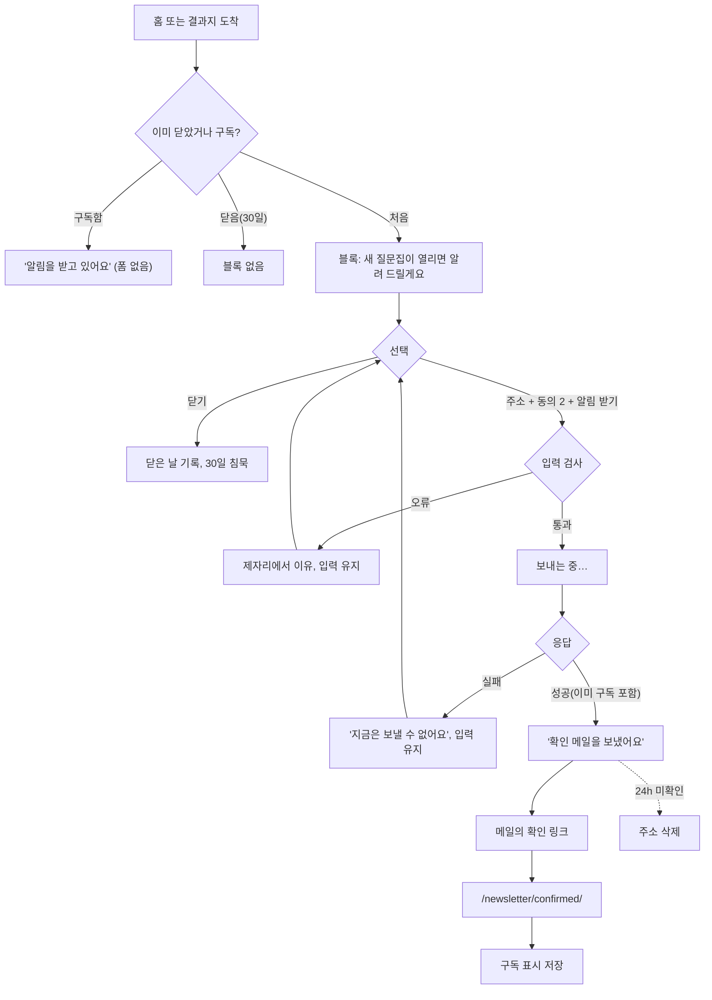
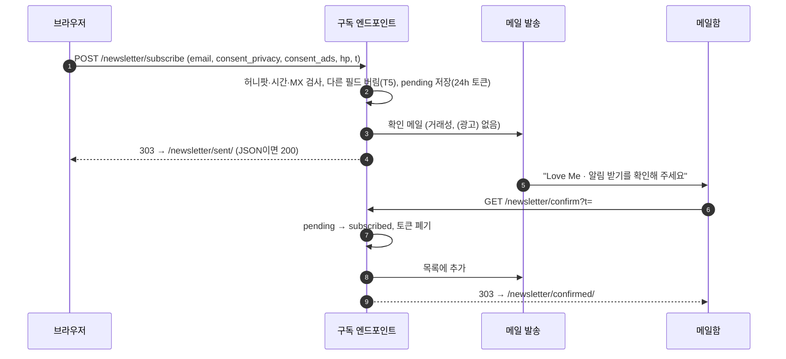

# 뉴스레터를 받을지 묻기 — UX 명세 (초안 1)

> 질문: "뉴스레터를 받을 것인지 묻는 기능을 넣고 싶어. 다른 유사 서비스를 리서치하여 UX 명세서를 작성해줘."
> 대상: `site/` (lovemedialogue.com). 상태: **제안 — 소유자 결정 D1~D4 대기.**
> 관련: `docs/WEB_SERVICE_STRATEGY.md`("The site earns attention and an email"), `docs/PRIVACY.md` 2.3,
> `docs/proposals/privacy-policy-ko.md:123-124`(현재 "광고성 메일은 보내지 않습니다" — 이 기능이 켜지면 고쳐야 함).
>
> 그림이 있는 판은 같은 내용의 아티팩트 페이지에 있습니다(와이어프레임·상태·메일 목업·깔때기). 이 파일은 저장소에
> 남는 텍스트 판이며, 다이어그램은 GitHub가 렌더하는 mermaid로 넣었습니다.

## 1. 목적

이 사이트는 지금까지 아무것도 받지 않았습니다. 뉴스레터는 독자가 자기 뜻으로 두고 가는 첫 번째 것이고, 그래서
묻는 방식이 곧 사이트의 신뢰입니다. 전략 문서는 웹의 역할을 "attention and an email"로 못 박습니다 — 검색은 구글이,
공유는 카카오가 쥐고 있지만 메일 목록은 운영자의 것입니다. 다만 "답을 서버로 보내지 않습니다"라는 약속이 목적의
절반을 정합니다. 뉴스레터는 **답과 분리된, 주소 하나만의 관계**여야 합니다.

해야 하는 일 셋: (1) 새 질문집을 알린다 — 홈의 「곧 열려요」 다섯 카드가 지금 사이트가 줄 수 있는 가장 구체적인 이유.
(2) 다시 오게 한다 — 100문항을 끝낸 독자에게 돌아올 계기가 없다. (3) 앱으로 가는 길을 연다.

하지 않을 일: 질문 쪽 열 장에서 묻지 않는다. 모달·전면·이탈 감지 팝업을 쓰지 않는다(구글 인터스티셜 판정, 방금 끝낸
SEO 작업의 반대). 답과 주소를 묶지 않는다(결과 전송은 X6, 별도 동의). 점수·판정·"당신의 관계"를 말하는 제목을 보내지
않는다(전략 문서 안전 절의 중립 제목).

**묻는 자리:** ① 홈의 「곧 열려요」 묶음 아래, ② 결과지의 공유·메일 절 아래. (③ 소개 쪽 끝은 선택.) 모두 본문 안의
블록이며 질문 쪽에는 없다. 묻는 순간은 "기다리는 것이 생긴 때"(①)와 "끝낸 때"(②) — 둘 다 독자 쪽에 이유가 있다.

## R. 유사 서비스 조사

프록시가 원본 대부분을 막아 검색 발췌문으로 확인했고, 미확인 항목은 표시했습니다.

### R-1. 플랫폼

| 서비스 | 묻는 형태 | 필드 | 더블 옵트인 | JS 없는 폼 | 데이터 | 동의 UI |
|---|---|---|---|---|---|---|
| Substack | 자기 사이트에서 도착 즉시 모달; 거절 문구를 "No thanks"로 바꿔 구독을 늘림(confirm-shaming). 임베드는 480px iframe | 이메일 | Substack 관리 | iframe만 | 미국(미확인) | 없음 |
| Buttondown | 순수 HTML 폼. **fetch로 보내지 말라**고 문서가 명시. "정적 사이트용" | 이메일 | 기본·강제 | 예 | 미국(AWS) | 없음 |
| Kit | JS 권장, HTML 폼 제공(`app.kit.com/forms/ID/subscriptions`) | 이메일 | 기본 켜짐 | 예 | 미국 외 | EU에만 미체크 박스 |
| Mailchimp | `list-manage.com/subscribe/post`. JS 끄면 Mailchimp 감사 페이지 | 이메일(+이름) | **기본 꺼짐** | 예 | 미국 | GDPR 채널별 박스 |
| beehiiv | iframe+script | 이메일·이름·생일 | 폼별 | 아니오 | 미국(AWS) | — |

### R-2. 국내

- **스티비** — 호스팅 페이지 + HTML 내보내기. 필수는 이메일뿐. **개인정보 수집·이용 동의 + 광고성 정보 수신 동의**
  두 체크박스가 폼 안에 있고 2년 재확인을 자동화. HTML 내보내기가 순수 폼인지·서버 위치 미확인. 어피티가 이 위에서 운영.
- **메일리** — iframe. 광고 수신 동의 박스. 처리방침에 국외이전 명시.
- **뉴닉** — 이름·이메일·직업 세 필드, "월/수/금 7시" 약속. 초기에 수신동의 없이 광고를 보내 비판 → (광고) 표기로 대응.
- **캐릿** — 이메일 필수·거부 시 제공 불가·(광고) 포함·해지 시 자동 삭제를 한 문단에. 고지 문안의 좋은 예.
- **롱블랙** — 회원가입 뒤에만. 계정 없는 사이트에는 맞지 않음.

법 요건(확인됨): 사전 동의·(광고) 표기·수신거부 방법(정보통신망법 §50); 수신동의는 개인정보 동의와 **별개 항목**;
2년마다 재확인, 재확인 안내는 (광고) 메일과 따로(시행령 §62의3); KISA 안내서 7차(2026-03): 「혜택 알림」 같은 모호한
명칭 불가, 입증 책임은 발신자; 필수 약관에 묶은 마케팅 동의는 무효(과태료 최대 1,000만 원); 국외 SaaS는 처리방침에
항목·국가·수령자·목적·기간을 적어야 별도 동의 없이 가능(개인정보보호법 §28의8).

### R-3. 관계·커플

Gottman「Marriage Minute」(전용 페이지, 이메일 하나, "every Tuesday and Thursday morning")과 Esther Perel(전용
`/newsletter`, "monthly")은 **전용 페이지 + 빈도 약속**으로 받고 활동을 끊지 않는다. Paired·Lasting·Between은 앱
설치만 밀고 메일을 받지 않는다. "활동을 끝낸 직후에 묻는" 검증 사례는 이 분야에서 찾지 못했다 → ②의 근거는 R-4.

### R-4. UX 연구와 수치

- NN/g: 도착 즉시 모달은 콘텐츠를 볼모로 잡음; 452명 조사에서 모달이 가장 미움받는 패턴; 이탈 팝업의 이득은 작고
  사용자에게 부정적; confirm-shaming은 다크 패턴.
- Baymard: 홈 뉴스레터 오버레이를 사용자가 "스팸"이라 부름; 상위 100 쇼핑몰의 절반이 박스를 미리 체크("sneaky");
  "메일이 너무 많다"가 해지 이유 2위.
- Google Search Central: 모바일 검색 도착 페이지의 콘텐츠를 가리는 팝업에 불이익(2017-). 쉽게 닫히는 배너는 예외.
- 수치(업체 자체 통계, 방향만): Sumo 평균 3.09% / 상위 10% 9.28%; Popupsmart 3.49%; Wisepops 2026 평균 4.82%,
  도착 즉시 3.93%, 이탈 감지 3.94%, **사용자가 눌러서 연 폼 54.42%**; IvyForms 의도 맞춤 인라인 45.5% vs 모달 25.96%;
  필드 하나당 완료율 10~20% 감소.

### R-5. 제3자 스크립트 없이 쓸 수 있는 길

| 길 | JS 없는 POST | 더블 옵트인 | 주소가 가는 곳 | 평가 |
|---|---|---|---|---|
| Buttondown action | 예 | 강제 | 미국 | 가장 단순. 제출 자체가 국외이전 |
| Kit HTML 폼 | 예 | 기본 | 미국 외 | 같음 |
| Mailchimp 폼 | 예 | 켜야 함 | 미국 | 기본이 싱글 옵트인 — 놓치면 P7 위반 |
| 스티비 HTML 내보내기 | 미확인 | 미확인 | 국내(미확인) | 법 요건이 도구 안에. **확인되면 1순위** |
| 자체 릴레이(Worker 또는 `server/`) | 예 | 직접 | 우리가 정함 | T5·T6을 코드로 보증. `server/mail.mjs`가 이미 Resend를 씀 |
| Formspree류 | 예 | 없음 | 미국 | 목록이 아님 |

### R-6. 본뜰 것 / 피할 것

본뜬다: 결과지 아래의 조용한 인라인 카드; 빈도 약속을 문안에; 필드 하나; 스티비식 두 체크박스; 캐릿식 한 문단 고지;
더블 옵트인 기본; 순수 `<form method="post">` + 같은 사이트로 복귀; 푸터의 조용한 진입점.
피한다: Substack식 도착 모달과 "No thanks"; 이탈 감지·활동 중 끼어들기; 미리 체크·묶은 동의; 세 필드; 모호한 동의
명칭; (광고) 메일에 2년 재확인 끼우기; 외부 감사 페이지로 보내기; Mailchimp 기본값 방치.

## 2. 요구사항

### 2-1. 제품

| # | 요구 | 근거 |
|---|---|---|
| P1 | 입력은 메일 주소 하나 | Substack·Buttondown 기본 폼, 스티비 필수 항목; 필드당 10~20% 감소 |
| P2 | 본문 안 인라인 블록만. 모달·슬라이드인·이탈 감지·스크롤 트리거 없음 | 전략 문서 광고 원칙, 구글 인터스티셜, NN/g |
| P3 | 질문 쪽에 넣지 않음. 홈 「곧 열려요」 아래와 결과지에만 | 집중을 깨지 않음; 결과지는 noindex |
| P4 | 첫 줄은 무엇을 보내는지: "새 질문집이 열리면 알려 드릴게요". "뉴스레터 구독" 금지 | Gottman·Perel의 약속형 문안, KISA 7차 |
| P5 | 빈도와 그만두는 법을 블록 안에서 미리 | Baymard 해지 이유 2위 |
| P6 | "답은 함께 가지 않아요. 주소만 받습니다." 한 문장 | 핵심 약속과의 충돌 방지 |
| P7 | **더블 옵트인**. 확인 전 주소는 24시간 뒤 삭제 | 상대가 내 주소를 넣을 수 있는 커플 사이트의 위험 |
| P8 | 닫거나 보내면 그 기기에서 다시 묻지 않음(30일). 구독 뒤엔 "알림을 받고 있어요" | 조르지 않음; `localStorage` 한 키 |
| P9 | JS 없이 동작(진짜 `<form method="post">`) | 사이트 원칙 (권장) |
| P10 | confirmed/unsubscribed/expired 쪽은 사이트 껍데기로 | 외부 화면이면 관계가 끊김 (권장) |

### 2-2. 법·동의 (대한민국)

전제: 새 질문집·앱 소식은 **영리 목적의 광고성 정보**로 본다. "정보성이라 동의 불요" 해석은 택하지 않는다. 최종 판단은
자문(`docs/PRIVACY.md` 2.3과 같은 지위).

| # | 요구 | 근거 |
|---|---|---|
| L1 | 수신 동의 명시적, 기본 해제, 항목별 체크박스 | 망법 §50①, 개보법 §22 |
| L2 | 동의 옆에 항목·목적·기간·거부권을 펼쳐 보임 | 개보법 §15② |
| L3 | 제목 맨 앞 (광고), 발신자 명칭·연락처·수신거부 링크 | 망법 §50④, 시행령 §61 |
| L4 | 2년마다 재확인, 재확인 안내는 (광고) 메일과 따로 | 시행령 §62의3 |
| L5 | `/privacy/`에 절 추가; "광고성 메일은 보내지 않는다" 문장 제거 | 개보법 §30 |
| L6 | 국외 업체면 국외이전 고지, 국내면 위탁 고지 | 개보법 §28의8; `docs/PRIVACY.md:115` |
| L7 | 만 14세 미만 제외 — "만 14세 이상만 받을 수 있어요" 한 줄 | 개보법 §22의2 |

### 2-3. 기술 (이 저장소의 규칙)

| # | 요구 |
|---|---|
| T1 | 제3자 스크립트 없음. 폼 `action`만 외부 또는 자체 엔드포인트 |
| T2 | 스위치는 `SITE.newsletter` 하나. 비면 블록·쪽·처리방침 절 모두 부재 (AdSense·문의·처리방침과 같은 패턴) |
| T3 | 문안은 `site/newsletter-copy.js` 한 모듈; 폰트 스캐너가 걷음 (`COVERAGE.txt` 계약) |
| T4 | 블록 문안은 콘텐츠 스탬프 해시에 넣지 않음(껍데기). 처리방침 절은 넣음 |
| T5 | 엔드포인트는 주소·동의 일시·IP·UA만 받고 답·결과·slug는 **버림** |
| T6 | 허니팟 + 시간 검사 + MX 확인. CAPTCHA 없음 |
| T7 | 테스트: endpoint 유무별 유무, 질문 쪽에 없음, 금지 문안, 폼이 JS 없이 완전, 폰트 커버리지 |

## 3. 사용자 시나리오

- **서연(31, 결혼 준비, 모바일)** — 검색으로 3쪽 도착, 사흘에 걸쳐 완료, 결과지에서 링크 공유. 아래 「다음 질문집이
  열리면」을 보고 홈의 「임신」 카드를 떠올려 신청. 확인 메일 → 사이트의 「알림을 받게 됐어요」. 두 달 뒤
  "(광고) 새 질문집이 열렸어요: 임신 100문답"으로 돌아옴. → 결과지에서 묻기, 확인 메일 1분 내, 확인 쪽이 사이트의 얼굴.
- **민준(38, 아이 계획, PC)** — 초대 링크로 홈 도착, 결혼은 관심 밖, 「곧 열려요」 출산·교육을 눌러 봄. 카드 아래에서
  주소만 남기고 떠남. → 홈에서 묻기, 답하지 않은 사람도 받기, 카드 이름으로 말하기.
- **지우(29, 통제적 관계, 모바일)** — 결과지의 블록을 보고 그만둠(상대가 휴대전화를 봄). 닫으면 다시 묻지 않음(P8);
  상대가 대신 넣어도 확인 없이는 아무것도 오지 않고 24시간 뒤 삭제(P7); 제목은 질문집 이름만(D4).
- **운영자(월 1회)** — 도구에서 새 메일, (광고)·수신거부가 템플릿에, 열람·클릭·해지가 한 화면, 2년째 재확인 자동.

시나리오가 정하는 것: 자리는 둘(①②), 더블 옵트인은 스팸 방지가 아니라 사람 보호를 위한 필수, 발송·해지·재확인은
도구 안에 있어야 한다(직접 짜지 않음).

## 4. 사용자 워크플로우





블록의 여섯 상태(같은 자리·같은 크기 안에서): ① 쉼 → ② 입력 오류(입력 유지) → ③ 보내는 중(버튼 잠김) → ④ 확인 메일
보냄(주소만 남김, 60초 뒤 다시 보내기) → ⑤ 구독 중(확인 링크를 같은 브라우저에서 눌렀을 때만 자동) / ⑥ 보내기 실패
(입력 유지, 다시 보내기). "이미 구독 중"도 ④와 같은 화면 — 어떤 주소가 목록에 있는지 폼이 밝히면 안 된다.

## 5. 기능 명세

### 5-1. 블록

제목(결과지) "다음 질문집이 열리면 알려 드릴게요" / (홈) "열리면 알려 드릴게요" → 본문 "임신·출산·교육·노년 질문집을
준비하고 있어요. 열리는 날 메일 한 통으로 알려 드립니다."(`COMING` 이름을 빌드 때 이어 붙임) → 한 줄 "한 달에 한 통
이하 · 답은 함께 가지 않아요, 주소만 받습니다 · 만 14세 이상" → [메일 주소] [알림 받기] → ☐ 개인정보 수집·이용에
동의합니다 (필수) → ☐ 새 질문집·앱 소식(광고성 정보)을 메일로 받는 데 동의합니다 (필수) → 고지 네 줄(항목/목적/기간/
거부/위탁·국외이전 ⟪업체명·국가⟫) → "닫기 — 이 기기에서 30일 동안 다시 묻지 않아요". 결과지의 공유·메일 절과 같은
카드 스타일.

### 5-2. 문안 (`site/newsletter-copy.js`, import 없음)

| 키 | 문안 |
|---|---|
| titleHome / titleResult | 열리면 알려 드릴게요 / 다음 질문집이 열리면 알려 드릴게요 |
| lead | 임신·출산·교육·노년 질문집을 준비하고 있어요. 열리는 날 메일 한 통으로 알려 드립니다. |
| note | 한 달에 한 통 이하 · 답은 함께 가지 않아요, 주소만 받습니다 · 만 14세 이상 |
| emailLabel / action | 메일 주소 / 알림 받기 |
| consentPrivacy | 개인정보 수집·이용에 동의합니다 (필수) |
| consentAds | 새 질문집·앱 소식(광고성 정보)을 메일로 받는 데 동의합니다 (필수) |
| disclosure | 항목: 메일 주소, 동의 일시, 확인 시 IP·브라우저 정보 / 목적: 새 질문집·앱 소식 발송 / 기간: 수신거부 또는 2년 재확인 거절 시까지, 확인하지 않은 주소는 24시간 뒤 삭제 / 거부: 동의하지 않아도 사이트는 그대로 쓸 수 있어요. 알림만 받지 못합니다 / 위탁·국외이전: 발송을 위해 메일 발송 업체(⟪업체명·국가⟫)에 주소를 맡깁니다 |
| dismiss | 닫기 — 이 기기에서 30일 동안 다시 묻지 않아요 |
| invalid / needConsent | 메일 주소를 다시 확인해 주세요. / 두 항목에 모두 동의해야 알림을 보낼 수 있어요. |
| sending / failed | 보내는 중… / 지금은 보낼 수 없어요. 잠시 뒤 다시 해 주세요. |
| sentTitle / sentBody | 확인 메일을 보냈어요 / 메일함을 열어 링크를 눌러 주세요. 누르기 전에는 아무것도 보내지 않아요. |
| resend | 안 왔나요? 스팸함을 보거나 다시 보내기 |
| subscribed / subscribedBody | 알림을 받고 있어요 / 새 질문집이 열리면 메일로 알려 드릴게요. 그만두려면 메일 맨 아래 '수신거부'를 눌러 주세요. |
| confirmedTitle / unsubscribedTitle / expiredTitle | 알림을 받게 됐어요 / 알림을 그만뒀어요 / 링크가 만료됐어요 |

금지 문안(테스트에 박음, `RESULT_FORBIDDEN`의 자매): 「구독」(제목·버튼), 「혜택」, 「무료」, 「지금」, 「놓치지 마세요」,
"No thanks"류 거절, 메일 제목의 「당신의」「관계」「점수」「결과」.

### 5-3. 스위치

```js
// site/config.js
newsletter: Object.freeze({
  endpoint: "",                        // 비면 블록·완료 쪽·처리방침 절 모두 없음 (T2)
  processor: { name: "", country: "" }, // 비면 endpoint가 있어도 빌드 실패 (L6)
  cadence: "한 달에 한 통 이하"          // note 문안과 테스트로 대조
})
```

`/newsletter/confirmed/`·`/unsubscribed/`·`/expired/` 세 standing 쪽은 endpoint가 있을 때만, 모두 noindex·사이트맵
제외·푸터 링크 없음.

### 5-4. 마크업

`<section class="newsletter" data-newsletter>` 안에 진짜 `<form method="post" action={endpoint}>`: hidden `from`
(home|result — 측정용), hidden `t`(표시 시각, 스크립트가 채움), 허니팟 `website`(`aria-hidden`, `tabindex=-1`),
`<label for>` + `<input type="email" required autocomplete="email" inputmode="email">`, 버튼, 체크박스 둘
(`required`, 미체크), `<details open>` 고지, `<p aria-live="polite" data-newsletter-state hidden>`. 섹션 밖에 닫기 버튼.

스크립트 없이: POST → 303 `/newsletter/sent/`. 스크립트(`site/newsletter.js`, `invite.js`처럼 자기 바인딩, ≤3KB):
fetch + 제자리 상태, `localStorage["lm.newsletter"] = { dismissedAt, subscribedAt }`. `data-result-clear`는 이 키를
건드리지 않음.

### 5-5. 엔드포인트

| 경로 | 받는 것 | 하는 것 | 돌려주는 것 |
|---|---|---|---|
| POST /newsletter/subscribe | email, consent_privacy, consent_ads, from, t, website. **그 밖은 버림** | 허니팟 비어 있음·표시 뒤 3초 이상·MX 검사 → pending(주소·동의 일시·IP·UA·토큰 24h) → 확인 메일. 같은 주소 10분 내 재요청은 재발송 없이 성공 | 폼 303 → /newsletter/sent/, JSON 200 {ok:true}. **검사 실패도 같은 응답**(목록 유무를 폼이 알 수 없어야 함). 5xx만 실패 |
| GET /newsletter/confirm?t= | 토큰 | pending → subscribed(확인 일시·IP), 토큰 폐기, 도구 목록에 추가 | 303 → /confirmed/ ; 만료·없음 → /expired/ |
| GET·POST /newsletter/unsubscribe | 주소별 서명 토큰(메일 맨 아래 + `List-Unsubscribe` 헤더) | 제거, 삭제 일시만(주소는 해시로 90일 — 증빙용) | 303 → /unsubscribed/. 확인 화면 없이 한 번에(§50④ 무료·즉시) |

### 5-6. 메일

- 확인 메일(거래성, (광고) 없음): 제목 "Love Me · 알림 받기를 확인해 주세요". 본문: 신청 사실, 본인이면 버튼, 아니면
  두면 24시간 뒤 삭제. 푸터: 상호·주소·연락처.
- 첫 알림(광고성): 제목 "(광고) 새 질문집이 열렸어요: 임신 100문답". 본문 두 문장 + 링크. 푸터: 상호·주소·연락처,
  동의 일자, 빈도, "수신거부 — 한 번 누르면 바로 그만둡니다". 제목은 질문집 이름만, "당신의 관계"류 없음(D4).
- 발신 주소는 Resend 도메인 인증(N6) 또는 스티비 발신 도메인 뒤에 완성.

### 5-7. 처리방침 절 (endpoint가 있을 때만; 기존 "광고성 메일은 보내지 않습니다" 문장은 조건부 제거)

```
제N조 (새 질문집 알림 메일)
① 운영자는 이용자가 직접 신청하고 확인 메일의 링크를 눌러 확인한 경우에만 알림 메일을 보냅니다.
② 수집 항목: 메일 주소, 동의 일시, 확인 시 접속 IP·브라우저 정보. 답한 내용은 수집하지 않습니다.
③ 목적: 새 질문집·앱 출시 소식 발송(영리 목적의 광고성 정보). 제목에 (광고)를 표시합니다.
④ 보유 기간: 수신거부 시까지. 2년마다 계속 받을지 확인하며, 확인하지 않은 신청은 24시간 뒤 삭제합니다.
⑤ 위탁·국외이전: 발송을 위해 ⟪업체명⟫(⟪국가⟫)에 메일 주소를 맡깁니다. 이전 항목·국가·목적·기간은 위와 같습니다.
⑥ 수신거부: 모든 메일 맨 아래 링크로 즉시·무료로 그만둘 수 있습니다.
```

### 5-8. 저장소에 닿는 곳

`site/config.js`(newsletter 블록) · `site/newsletter-copy.js`(새) · `site/newsletter.js`(새) · `site/render.js`
(`newsletterBlock(where)`: renderIndex는 「곧 열려요」 뒤, renderResultPage는 result-mail 뒤) · `site/pages.js`
(세 standing 쪽, privacyCopy 제N조) · `site/site.css` · `site/stamp.js`(변경 없음 — 블록은 해시 밖, 처리방침 절은 안)
· `scripts/build-brand-assets.py`(스캐너 한 줄) + 폰트 재생성 · `test/site.test.js` · `server/newsletter.mjs`(D2)
· `docs/PRIVACY.md`·`docs/proposals/privacy-policy-ko.md`·`docs/OWNER_ACTIONS.md`(N7 도구 결정, N8 발신 도메인).

### 5-9. 배포 순서

1. 소유자 결정 D1~D4 → 2. 발신 도메인(N6) → 3. 엔드포인트(세 경로 + 24h 청소, 실제 주소로 신청→만료→해지 한 바퀴)
→ 4. 사이트(문안·블록·세 쪽·처리방침 절·폰트·테스트; endpoint 빈 채 머지해도 무변화를 테스트가 보증) → 5. `SITE.newsletter`
채우는 커밋 하나 = 배포 → 6. 첫 발송(두 번째 질문집 공개일; (광고)·수신거부·List-Unsubscribe 체크리스트).

## 6. 기능의 효용

**독자에게:** 「곧 열려요」에 지키는 방법이 붙는다. 결과지의 끝이 "지우기"가 아니라 "다음"이 된다. 두고 가는 것이 주소
하나뿐이라 두 번째(X6, 앱)가 가능해진다.

**사이트에게 — 깔때기(가정치):** 월 방문 1,000(가정) → 결과지 도달 15% = 150 → 제출: 결과지 8% = 12 + 홈 2% = 20 →
확인 70% = **22/월** → 첫 알림 재방문 ~9(열람 50% × 클릭 80%). 제출률은 R-4의 의도 맞춤 45%의 5분의 1, 홈은 팝업
평균의 절반으로 보수적으로 잡았고, 방문 수는 서치콘솔(소유자 행동 8·9) 뒤 실제 값으로 교체, 나머지 비율은 `from`
필드로 첫 달에 직접 잰다. 열두 달이면 ~260명 — 두 번째 질문집이 열리는 날, 검색이 새 쪽을 찾기 전의 첫 방문자.

- 운영자가 가진 유일한 채널(검색은 구글, 공유는 카카오의 것; 목록은 내보내기 한 번으로 이동; 애드센스 심사와 무관).
- 새 질문집의 첫날 방문자(색인 공백을 메움, 첫날 신호가 순위에 남음).
- 앱으로 가는 다리("attention and an email").
- SEO에 해 없음(인라인은 인터스티셜 판정 밖, 완료 쪽 noindex, 메일발 직접 방문은 신호).

**약속에게 — 지키는 것과 비용:**

| 지키는 것 | 어떻게 | 비용 |
|---|---|---|
| 답을 서버로 보내지 않음 | 주소와 답을 다른 요청·저장소·동의로 분리(P6·T5) | "결과를 메일로" 유인을 쓰지 않음(X6의 몫) |
| 제3자 스크립트 없음 | 순수 폼 + 자체 릴레이/스크립트 없는 action(T1) | 예쁜 임베드 포기, 엔드포인트 하나 운영 |
| 끼어들지 않음 | 모달·이탈 감지 없음, 질문 쪽 없음(P2·P3) | 팝업 평균 4% 포기 — 대신 의도 있는 자리의 높은 비율 |
| 받은편지함이 안전함 | 더블 옵트인(P7), 중립 제목, 한 번에 해지 | 제출의 ~3할이 목록에 오르지 않음 — 감수 |

## 소유자 결정 사항

- **D1 발송 도구** — 권장 **스티비**(HTML 내보내기가 순수 폼이고 서버가 국내임이 확인될 때). 아니면 **자체 릴레이 +
  Resend**(국외이전 고지). Buttondown은 단순하나 제출 자체가 국외이전이고 2년 재확인이 도구에 없음.
- **D2 엔드포인트 위치** — 스티비면 Cloudflare Worker(얇은 릴레이 + 24h 청소), Resend면 `server/`.
- **D3 처리방침 자문** — 제N조 문안과 "광고성 정보" 판단을 자문에. 권장: 넘김.
- **D4 메일 제목 수위** — 질문집 이름을 말할지("(광고) 새 질문집이 열렸어요: 임신 100문답") "Love Me · 새 소식"으로
  줄일지. 권장: 전자, 단 상대가 보면 곤란할 이름은 후자.

정하지 않은 것: 결과지 전송(X6)과 계정 — 별도 동의·별도 문서. 이 기능은 그 둘보다 먼저, 무관하게 켤 수 있다.

## 출처

Substack(support, substackapi, unstackit) · Buttondown(docs: subscriber base, double opt-in, subprocessors) · Kit(help:
embedding, double opt-in, GDPR FAQ) · Mailchimp(help: embedded form, opt-in settings, GDPR forms) · beehiiv(support, GDPR)
· 스티비(help: 구독 폼, 광고성 정보 수신동의) · 메일리(guides, privacy_agreement) · 뉴닉·캐릿·어피티·롱블랙 구독/처리방침
쪽 · Gottman「Marriage Minute」· Esther Perel newsletter · 정보통신망법 §50, 시행령 §62의3(law.go.kr) · KISA 안내서 7차
(2026-03) · privacy.go.kr 국외이전 · NN/g(Popups, Overlay Overload, Exit-intent, Modal dialogs) · Baymard(Homepage UX,
Checkout, Newsletter frequency) · Google Search Central(intrusive interstitials) · Wisepops 2026 · Popupsmart 2025 · Sumo
· IvyForms · caro.fyi Cloudflare 메일링 리스트 · dev.to Pages + 더블 옵트인. 전체 URL은 아티팩트 판의 출처 절에.
